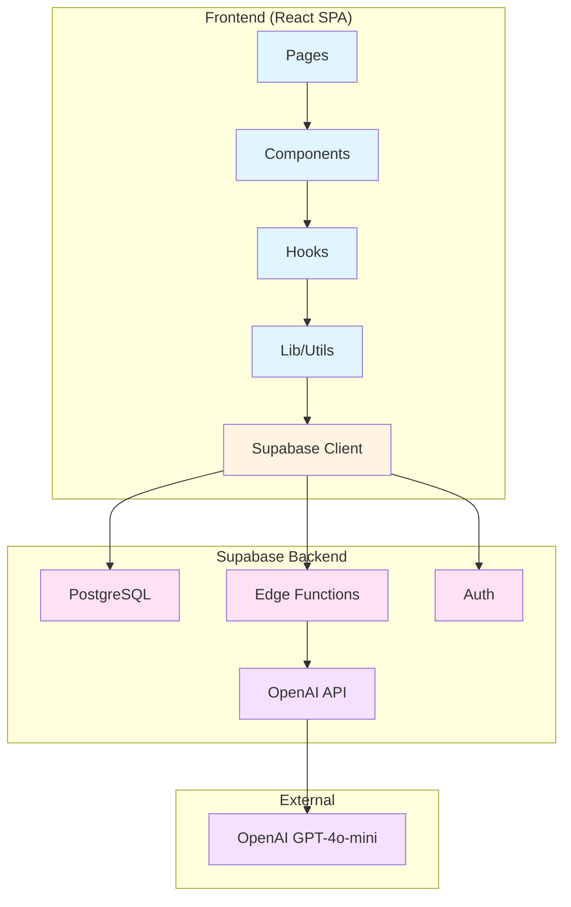
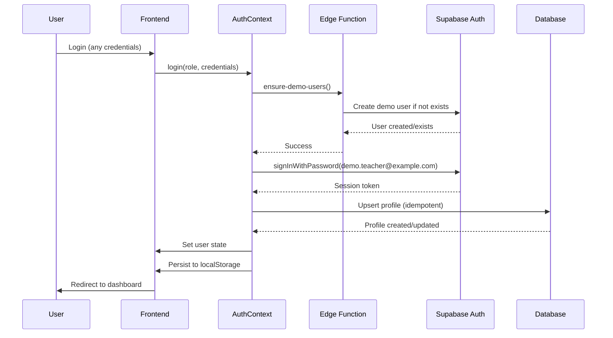
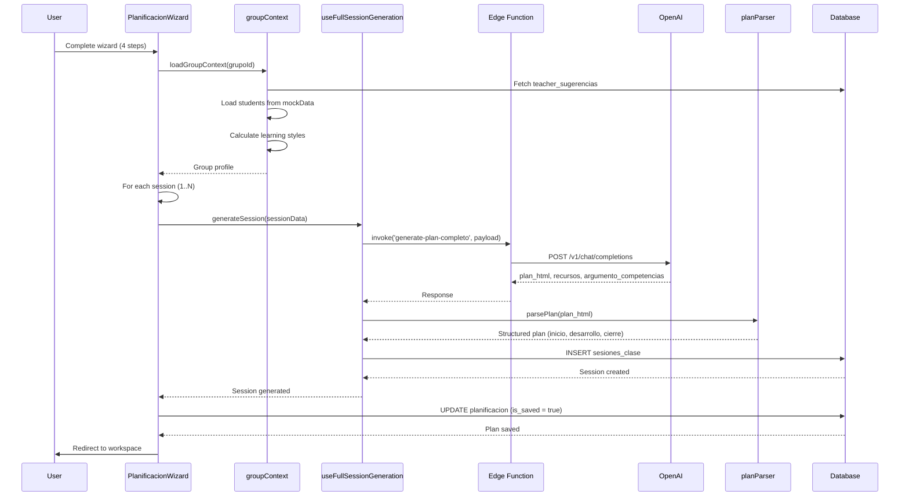
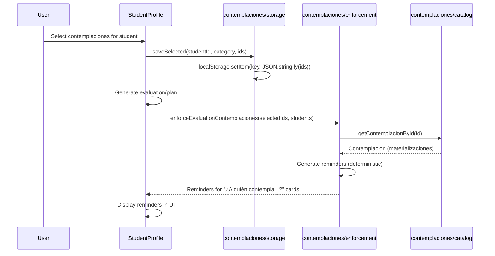

# AulaPlus v0 - Architecture (Single Source of Truth)

> **Purpose**: This document defines the architectural contract for AulaPlus. It establishes boundaries, responsibilities, and rules for safe changes. Use this as the ONLY reference for development decisions.
>
> **Last Updated**: January 26, 2026  
> **Status**: Active

---

## 1. Architecture Style

**Pattern**: **Modular Monolith (Frontend SPA + Backend-as-a-Service)**

- **Frontend**: Single React SPA with feature-based organization
- **Backend**: Supabase (PostgreSQL + Auth + Edge Functions)
- **AI Integration**: OpenAI GPT-4o-mini via Supabase Edge Functions
- **Deployment**: Lovable.dev (frontend) + Supabase Cloud (backend)

**Rationale**:
- Single codebase simplifies development and deployment
- Supabase provides managed database, auth, and serverless functions
- No need for separate microservices at current scale
- Clear separation: Frontend (React) ↔ Backend (Supabase) via client SDK

---

## 2. System Diagram



---

## 3. Runtime Boundaries

### 3.1 Processes/Services

| Process | Technology | Location | Purpose |
|---------|-----------|----------|---------|
| **Frontend Dev Server** | Vite | `npm run dev` | Local development (port 8080) |
| **Frontend Build** | Vite | `npm run build` | Production static build (`dist/`) |
| **Supabase Database** | PostgreSQL | Supabase Cloud | Data persistence |
| **Supabase Auth** | Supabase Auth | Supabase Cloud | User authentication |
| **Edge Functions** | Deno | Supabase Cloud | Serverless business logic (AI generation) |

**No Background Workers**: All processing is synchronous (AI calls happen during user request)

**No Cron Jobs**: No scheduled tasks currently

### 3.2 Internal Modules/Packages

```
src/
├── pages/              # Route-level components (orchestration)
├── components/         # Reusable UI components
│   ├── evaluaciones/  # Evaluation-specific components
│   ├── planificacion/ # Planning-specific components
│   └── ui/            # shadcn/ui primitives
├── hooks/             # Custom React hooks (business logic)
├── lib/               # Pure utilities, parsers, validators
│   └── contemplaciones/ # Contemplaciones system (catalog, defaults, enforcement)
├── contexts/          # React contexts (AuthContext)
├── integrations/      # External service clients (Supabase)
├── data/              # Static data (competencies, mock data)
├── types/             # TypeScript type definitions
└── utils/             # Shared utilities (groupContext)
```

**Dependency Rules**:
- `pages/` → `components/`, `hooks/`, `lib/`, `contexts/`
- `components/` → `hooks/`, `lib/`, `ui/`
- `hooks/` → `lib/`, `integrations/`
- `lib/` → NO dependencies on `components/`, `pages/`, `hooks/` (pure functions)
- `data/` → NO dependencies (static data only)

---

## 4. Component Responsibilities

### 4.1 Frontend Layer

#### Pages (`src/pages/`)
**Responsibility**: Route-level orchestration, feature entry points

**Owns**:
- Route-specific state management
- Feature flow coordination
- Data fetching (via hooks)
- Navigation logic

**Must NOT**:
- Contain business logic (delegate to hooks)
- Contain complex UI (delegate to components)
- Directly call Supabase (use hooks)

**Key Files**:
- `PlanificacionWizard.tsx`: 4-step wizard for lesson plan creation
- `PlanificacionWorkspace.tsx`: Calendar view + session editor
- `EvaluacionesGrupo.tsx`: Evaluation generation wizard
- `TeacherGroups.tsx`: Group profile management

#### Components (`src/components/`)
**Responsibility**: Reusable UI, feature-specific UI

**Owns**:
- UI rendering
- User interactions (clicks, form inputs)
- Visual state (expanded/collapsed, selected)

**Must NOT**:
- Fetch data directly (receive via props)
- Contain business logic (delegate to hooks)
- Know about routing (use callbacks)

**Key Files**:
- `StudentProfile.tsx`: Individual student profile with Informe Técnico accordion
- `GroupProfile.tsx`: Group learning style distribution
- `EditorSesionNuevo.tsx`: Session plan editor
- `CalendarioDnD.tsx`: Drag-and-drop calendar

#### Hooks (`src/hooks/`)
**Responsibility**: Business logic, data fetching, state management

**Owns**:
- API calls (Supabase queries, edge function invocations)
- State machines (wizard flows)
- Data transformation
- Cache management (React Query)

**Must NOT**:
- Render UI (return data/state, components render)
- Know about specific components (generic logic)

**Key Files**:
- `usePlanificacionWizard.ts`: Wizard state machine (paso 0-3)
- `useFullSessionGeneration.ts`: AI session generation orchestration
- `useCalendarioSesiones.ts`: Calendar state (drag-and-drop, slot booking)
- `useBulletinGenerator.ts`: Bulletin text generation

#### Lib (`src/lib/`)
**Responsibility**: Pure utilities, parsers, validators, domain logic

**Owns**:
- Pure functions (no side effects)
- Parsing logic (HTML → structured data)
- Validation rules
- Domain calculations

**Must NOT**:
- Have side effects (no API calls, no localStorage writes)
- Depend on React (no hooks, no components)
- Know about UI (pure data transformations)

**Key Files**:
- `planParser.ts`: Parse AI-generated HTML into structured plan
- `normalizeSupabaseArrays.ts`: Fix Supabase array serialization bugs
- `contentCleaner.ts`: Sanitize HTML content
- `contemplaciones/`: Contemplaciones system (catalog, defaults, enforcement, storage)

#### Contexts (`src/contexts/`)
**Responsibility**: Global application state

**Owns**:
- Authentication state
- User session
- Global preferences

**Must NOT**:
- Contain business logic (delegate to hooks)
- Know about specific features (generic state only)

**Key Files**:
- `AuthContext.tsx`: User authentication, session management

### 4.2 Backend Layer

#### Edge Functions (`supabase/functions/`)
**Responsibility**: Serverless business logic, AI integration

**Owns**:
- AI prompt construction
- OpenAI API calls
- Response validation
- Error handling and retries

**Must NOT**:
- Access database directly (use Supabase client if needed)
- Know about frontend structure (return generic JSON)
- Store state (stateless functions)

**Key Files**:
- `generate-plan-completo/index.ts`: Generate HTML lesson plans
- `modify-evaluation/index.ts`: Modify evaluations OR generate plain-text plans
- `generate-bulletin-text/index.ts`: Generate bulletin text
- `ensure-demo-users/index.ts`: Setup demo users

#### Database (`supabase/migrations/`)
**Responsibility**: Data persistence, schema definition, RLS policies

**Owns**:
- Table schemas
- Foreign key relationships
- Row Level Security (RLS) policies
- Indexes
- Triggers

**Must NOT**:
- Contain business logic (pure data storage)
- Know about application code (database-agnostic)

**Key Tables**:
- `planificaciones`: Lesson plans (multi-week)
- `sesiones_clase`: Individual class sessions
- `evaluaciones`: Generated evaluations
- `grupos`: Group metadata and teacher suggestions
- `profiles`: Extended user profiles

---

## 5. Data Layer

### 5.1 Database Schema

**Database**: PostgreSQL (hosted by Supabase)

**Key Tables**:

| Table | Purpose | Owner | RLS Policy |
|-------|---------|-------|------------|
| `planificaciones` | Multi-week lesson plans | `user_id` | `auth.uid() = user_id` |
| `sesiones_clase` | Individual class sessions | Via `planificacion.user_id` | `EXISTS (SELECT 1 FROM planificaciones WHERE id = planificacion_id AND user_id = auth.uid())` |
| `evaluaciones` | Generated evaluations | `user_id` | `auth.uid() = user_id` |
| `grupos` | Group metadata | `user_id` | `auth.uid() = user_id` |
| `profiles` | Extended user profiles | `user_id` | `auth.uid() = user_id` |

**Data Invariants**:
1. **Explicit Save Pattern**: `is_saved = true` → appears in "Mis X" lists
2. **Soft Delete Pattern**: `deleted_at IS NULL` → active record
3. **User Isolation**: All tables enforce RLS (users only see own data)
4. **Session-Plan Relationship**: `sesiones_clase.planificacion_id` → `planificaciones.id` (FK, CASCADE DELETE)

### 5.2 LocalStorage (Client-Side)

**Purpose**: Client-side persistence for contemplaciones and user preferences

**Keys** (Canonical Format):
- `contemplaciones_clase_${studentId}` → `string[]` (selected contemplacion IDs)
- `contemplaciones_evaluaciones_${studentId}` → `string[]` (selected contemplacion IDs)
- `contemplaciones_custom_clase_${studentId}` → `CustomContemplacion[]`
- `contemplaciones_custom_evaluaciones_${studentId}` → `CustomContemplacion[]`
- `contemplaciones_seed_meta_clase_${studentId}` → `SeedingMetadata`
- `aulaplus_defaults_version` → `string` (e.g., "v999")
- `auth_user` → `User` (mock user data for demo)

**Ownership**: `src/lib/contemplaciones/storage.ts` (single source of truth for localStorage keys)

### 5.3 Mock Data

**Location**: `src/data/mockData.ts`

**Purpose**: Demo data for groups and students (not in database yet)

**Contains**:
- `mockGroups`: Array of groups with students
- Student data: learning styles, contemplaciones, informeTecnico

**Future**: Migrate to `students` table in Supabase

---

## 6. Integration Points

### 6.1 External Services

| Service | Purpose | Integration Point | Authentication |
|---------|---------|-------------------|----------------|
| **Supabase** | Database, Auth, Edge Functions | `src/integrations/supabase/client.ts` | JWT (anon key) |
| **OpenAI API** | AI lesson plan generation | `supabase/functions/generate-plan-completo/index.ts` | API Key (env var) |
| **Supabase Auth** | User authentication | `src/contexts/AuthContext.tsx` | Email/password (demo) |

### 6.2 Integration Boundaries

- **Frontend ↔ Supabase**: Direct client queries with RLS enforcement
- **Frontend ↔ Edge Functions**: `supabase.functions.invoke()` calls
- **Edge Functions ↔ OpenAI**: Direct HTTPS API calls
- **No direct database access**: All data access via Supabase client (RLS enforced)

---

## 7. Core Flows

### 7.1 Authentication Flow



**Key Files**: `src/contexts/AuthContext.tsx`, `supabase/functions/ensure-demo-users/index.ts`

### 7.2 Lesson Plan Creation Flow



**Key Files**: 
- `src/pages/PlanificacionWizard.tsx`
- `src/hooks/useFullSessionGeneration.ts`
- `supabase/functions/generate-plan-completo/index.ts`
- `src/lib/planParser.ts`

### 7.3 Contemplaciones Enforcement Flow



**Key Files**:
- `src/lib/contemplaciones/catalog.ts`
- `src/lib/contemplaciones/enforcement.ts`
- `src/lib/contemplaciones/storage.ts`

---

## 8. Cross-Cutting Concerns

### 8.1 Authentication/Authorization

**Model**: Demo-only (NOT production-ready)

**Implementation**:
- Frontend: Mock auth (any credentials accepted)
- Backend: Supabase Auth with demo user (`demo.teacher@example.com`)
- Session: JWT token stored in localStorage
- RLS: All tables enforce `auth.uid() = user_id`

**Security Risks**:
- ⚠️ No real user management
- ⚠️ All users share same Supabase user
- ⚠️ Service role key exposed (in edge function)

**Recommendation**: Implement real authentication before production

### 8.2 Error Handling

**Frontend**:
- **Error Boundaries**: `src/components/ErrorBoundary.tsx` catches React errors
- **Try/Catch**: All async operations wrapped
- **User Feedback**: Toast notifications (Sonner)
- **Error Logging**: `console.error()` in DEV mode only

**Edge Functions**:
- **Retry Logic**: Exponential backoff for OpenAI rate limits (3 attempts, base delay: 2000ms)
- **Error Responses**: JSON error responses with status codes
- **CORS Headers**: All edge functions include CORS headers

**Pattern**:
```typescript
try {
  // operation
} catch (error: any) {
  if (import.meta.env.DEV) {
    console.error('[CONTEXT] Error:', error);
  }
  toast({ title: "Error", description: "User-friendly message", variant: "destructive" });
}
```

### 8.3 Configuration Management

**Environment Variables**:

| Variable | Required | Location | Purpose |
|----------|----------|----------|---------|
| `VITE_SUPABASE_URL` | ✅ | `.env` (root) | Supabase project URL |
| `VITE_SUPABASE_ANON_KEY` | ✅ | `.env` (root) | Supabase anonymous key (public) |
| `OPENAI_API_KEY` | ✅ | Supabase Dashboard | OpenAI API key for edge functions |
| `SERVICE_ROLE_KEY` | ✅ | Supabase Dashboard | Supabase service role (admin) |

**Configuration Files**:
- `vite.config.ts`: Build config, path aliases (`@/` → `src/`)
- `tailwind.config.ts`: Tailwind theme, custom colors
- `tsconfig.json`: TypeScript compiler options
- `supabase/config.toml`: Supabase project ID, edge function JWT settings

### 8.4 Testing Strategy

**Current State**: ❌ No testing framework configured

- No Jest, Vitest, or testing libraries in `package.json`
- One test file exists: `src/__tests__/sessionBriefMapping.test.ts` (appears unused)

**Recommendation**: Add Vitest + React Testing Library

**Test Pyramid** (Recommended):
- **Unit Tests**: `lib/` utilities (planParser, validators)
- **Integration Tests**: Hooks (useFullSessionGeneration, usePlanificacionWizard)
- **E2E Tests**: Critical flows (plan creation, evaluation generation)

### 8.5 Security Considerations

**Visible in Repo**:
- **CORS**: Edge functions allow all origins (`Access-Control-Allow-Origin: *`)
- **RLS**: All tables enforce Row Level Security
- **Rate Limiting**: OpenAI retry logic (3 attempts, exponential backoff)
- **Secrets Handling**: API keys stored in Supabase Dashboard (not in code)

**Missing**:
- ❌ No request throttling on frontend
- ❌ No input sanitization for user-generated content (HTML)
- ❌ No CSRF protection (not needed for SPA with JWT)
- ❌ No rate limiting on Supabase queries

---

## 9. "Where to Change Things" Guide

### Adding a New Page/Route

1. **Create page**: `src/pages/NewPage.tsx`
2. **Add route**: `src/App.tsx` → `AppRoutes` component
3. **Add navigation**: `src/components/AppSidebar.tsx` → `navigationItems` array
4. **Add breadcrumb** (if needed): `src/components/Breadcrumbs.tsx`

**Rules**:
- Use `ProtectedTeacherRoute` or `ProtectedStudentRoute` wrapper
- Follow existing page component structure
- Add to appropriate navigation group

### Modifying Database Schema

1. **Create migration**: `supabase/migrations/YYYYMMDDHHMMSS_description.sql`
2. **Add RLS policies**: Enable RLS, create policies for new tables
3. **Test locally**: `supabase db reset`
4. **Update types**: `supabase gen types typescript` → update `src/integrations/supabase/types.ts`
5. **Update application code**: Use new types, handle new columns

**Rules**:
- Never modify existing migrations
- Always include RLS policies
- Always test migration sequence
- Update TypeScript types immediately

### Adding a New Edge Function

1. **Create function**: `supabase/functions/new-function/index.ts`
2. **Configure**: `supabase/functions/new-function/config.toml` (JWT settings)
3. **Add CORS headers**: Include CORS headers in responses
4. **Deploy**: `supabase functions deploy new-function`
5. **Call from frontend**: `supabase.functions.invoke('new-function', { body: {...} })`

**Rules**:
- Use Deno runtime (not Node.js)
- Handle CORS preflight (OPTIONS requests)
- Include error handling and retry logic (if calling external APIs)
- Set secrets via Supabase Dashboard

### Modifying AI Prompt

**File**: `supabase/functions/generate-plan-completo/index.ts`

**Rules**:
- Modify prompt sections (lines 177-265)
- Maintain HTML structure requirements
- Test with different inputs
- **Warning**: Prompt changes affect all future generations (not backward compatible)

### Adding a New Contemplación

1. **Update catalog**: `src/lib/contemplaciones/catalog.ts` → Add to `CONTEMPLACIONES_CATALOG`
2. **Update defaults** (if needed): `src/lib/contemplaciones/defaults.ts` → Add to student defaults
3. **Test enforcement**: Verify reminders appear in evaluation cards
4. **Update documentation**: `docs/CONTEMPLACIONES_CATALOG.md`

**Rules**:
- Use canonical ID format: `contemplacion-{number}`
- Define materializaciones (how it appears in UI)
- Specify category (`clase`, `evaluaciones`, `ambas`)
- Add to defaults if commonly needed

### Modifying Plan Parser

**File**: `src/lib/planParser.ts`

**Rules**:
- **CRITICAL**: Maintain backward compatibility with existing saved plans
- Test with existing plan HTML from database
- Changes must not break parsing of old plans
- Add new parsing logic, don't remove old logic (unless deprecating)

---

## 10. Guardrails and Invariants

### What Must NOT Break

1. **Authentication Flow**:
   - Users must be able to log in
   - Profiles must auto-create on first login
   - Session must persist across page reloads
   - **Files**: `src/contexts/AuthContext.tsx`, `supabase/functions/ensure-demo-users/index.ts`

2. **Data Isolation**:
   - RLS policies must enforce user isolation
   - Users must only see their own data
   - **Enforced by**: Database RLS (cannot be bypassed)

3. **Plan Parser Backward Compatibility**:
   - Must parse all existing saved plans
   - HTML structure changes must be additive only
   - **File**: `src/lib/planParser.ts`

4. **Explicit Save Pattern**:
   - `is_saved = true` → appears in "Mis X" lists
   - `is_saved = false` → draft, not in lists
   - **Enforced by**: Application queries (WHERE is_saved = true)

5. **Session-Plan Relationship**:
   - Sessions must belong to a plan (FK constraint)
   - Deleting plan deletes sessions (CASCADE)
   - **Enforced by**: Database foreign key

6. **AI Generation Contract**:
   - Edge function must return: `{ plan_html, argumento_competencias, recursos, titulo }`
   - HTML must contain `<section id="plan">` with H1, H2 sections
   - **File**: `supabase/functions/generate-plan-completo/index.ts`

7. **Contemplaciones Catalog**:
   - Catalog IDs must remain stable (no breaking changes)
   - Defaults versioning must be backward compatible
   - **Files**: `src/lib/contemplaciones/catalog.ts`, `src/lib/contemplaciones/defaults.ts`

### Coupling Hotspots

1. **`planParser.ts` ↔ Saved Plans**:
   - Parser must understand all existing plan HTML structures
   - **Risk**: Changing parser breaks existing plans
   - **Mitigation**: Test with existing plans, maintain backward compatibility

2. **`AuthContext.tsx` ↔ All Protected Routes**:
   - All routes depend on AuthContext
   - **Risk**: Auth changes break all routes
   - **Mitigation**: Test auth flow after changes

3. **Database RLS Policies ↔ All Queries**:
   - All queries depend on RLS policies
   - **Risk**: Policy changes break queries
   - **Mitigation**: Test queries after policy changes

4. **Edge Functions ↔ Frontend Hooks**:
   - Hooks expect specific response format
   - **Risk**: Function changes break frontend
   - **Mitigation**: Maintain API contract, version functions if needed

5. **Contemplaciones Catalog ↔ Enforcement**:
   - Enforcement depends on catalog structure
   - **Risk**: Catalog changes break enforcement
   - **Mitigation**: Version catalog, maintain backward compatibility

---

## 11. Navigation Index

### Minimum Files to Understand the System

**Start Here** (Core Architecture):
1. `src/main.tsx` - Application entry point
2. `src/App.tsx` - Routing and app structure
3. `src/integrations/supabase/client.ts` - Database client setup
4. `src/contexts/AuthContext.tsx` - Authentication

**Core Flows**:
5. `src/pages/PlanificacionWizard.tsx` - Lesson plan creation flow
6. `src/hooks/useFullSessionGeneration.ts` - AI generation orchestration
7. `supabase/functions/generate-plan-completo/index.ts` - AI generation logic
8. `src/lib/planParser.ts` - Plan parsing (critical for compatibility)

**Data Layer**:
9. `supabase/migrations/20250923163758_*.sql` - Initial schema
10. `src/integrations/supabase/types.ts` - TypeScript types

**UI Structure**:
11. `src/components/AppLayout.tsx` - Layout wrapper
12. `src/components/AppSidebar.tsx` - Navigation

**Contemplaciones System**:
13. `src/lib/contemplaciones/catalog.ts` - Canonical catalog
14. `src/lib/contemplaciones/enforcement.ts` - Deterministic enforcement
15. `src/lib/contemplaciones/storage.ts` - localStorage persistence

**Understanding a Feature**:
- Read the page component (`src/pages/FeatureName.tsx`)
- Read related hooks (`src/hooks/useFeatureName.ts`)
- Read related components (`src/components/feature-name/`)
- Check database schema (migrations)
- Check contemplaciones catalog (if feature uses contemplaciones)

---

## 12. Appendix: Architecture Decisions

### Why Modular Monolith?

- **Single codebase**: Easier development, deployment, debugging
- **Supabase BaaS**: Managed database, auth, edge functions reduce operational overhead
- **No microservices needed**: Current scale doesn't justify service boundaries
- **Clear separation**: Frontend (React) ↔ Backend (Supabase) via client SDK

### Why React Query?

- **Server state management**: Automatic caching, invalidation, refetching
- **Optimistic updates**: Better UX for save operations
- **Error handling**: Built-in retry logic
- **DevTools**: Excellent debugging experience

### Why Contemplaciones in localStorage?

- **Client-side only**: Contemplaciones are UI preferences, not server data
- **Fast access**: No API calls needed
- **Versioning**: Migration system handles schema changes
- **Future**: Can migrate to Supabase if needed (storage.ts abstracts this)

### Why HTML Parsing (not JSON)?

- **AI output**: OpenAI generates HTML naturally
- **Flexibility**: HTML allows rich formatting
- **Backward compatibility**: Existing plans are HTML
- **Trade-off**: Parsing is brittle, but acceptable for current use case

---

**End of Architecture Document**

