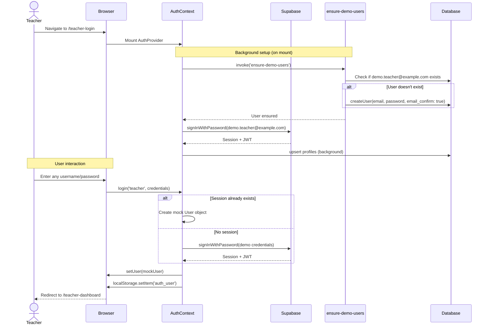
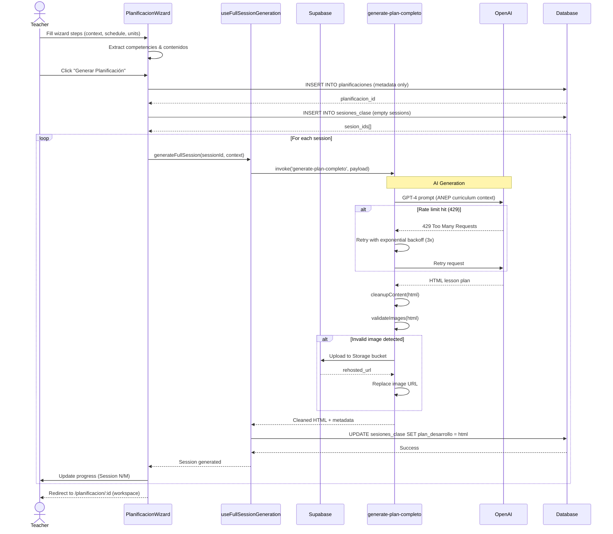
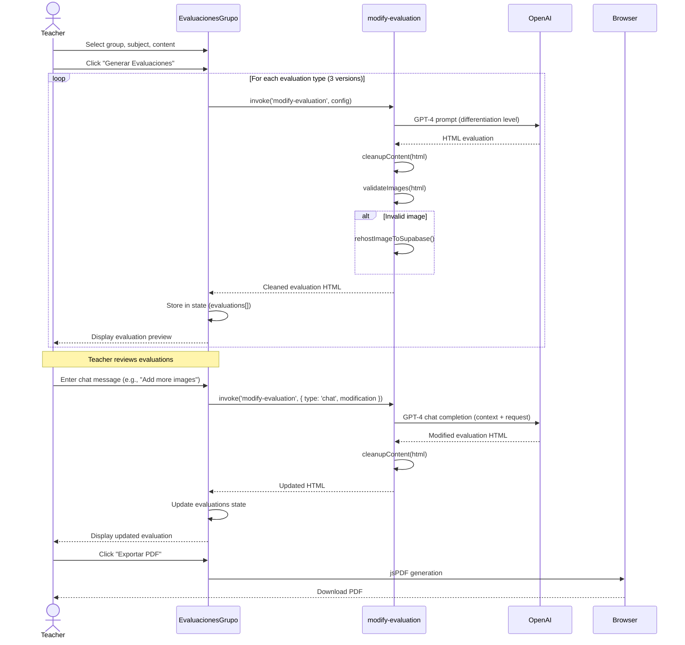

# AulaPlus v0 - Complete Architecture Analysis

**Run ID:** 2025-10-28_architecture_analysis  
**Date:** October 28, 2025  
**Analyst:** Claude (Staff+ Architect Mode)  
**Repository:** aulaplus-v0 (deploy-v1 branch)  
**Owner:** Alenwuhl

---

## Executive Summary

**AulaPlus v0** is a pedagogical intelligence platform designed for the Uruguayan education system (ANEP). It provides AI-powered tools for teachers to:

- Generate intelligent lesson plans aligned with ANEP competencies
- Create differentiated evaluations for diverse student groups
- Generate personalized student bulletin texts
- Manage class schedules and academic communications

**Architecture Type:** Full-stack single-page application (SPA)  
**Primary Stack:** React 18 + TypeScript + Supabase (BaaS) + OpenAI GPT-4  
**Deployment:** Lovable.dev platform (Vite-based)  
**Monorepo:** No (single application)  
**State:** Production-ready demo with some technical debt

---

## 1. Repository Overview

### 1.1 Top-Level Folder Structure

```
aulaplus-v0-main/
├── .git/                          # Git repository metadata
├── node_modules/                  # npm dependencies (gitignored)
├── dist/                          # Build output (gitignored)
├── public/                        # Static assets
│   ├── favicon.ico
│   ├── placeholder.svg
│   └── robots.txt
├── src/                           # Application source code
│   ├── components/                # React components (60+ files)
│   ├── contexts/                  # React contexts (Auth)
│   ├── data/                      # Static data (competencies, mock data)
│   ├── hooks/                     # Custom React hooks (7 files)
│   ├── integrations/              # External service clients (Supabase)
│   ├── lib/                       # Utility functions and helpers
│   ├── pages/                     # Top-level page components (10 files)
│   ├── types/                     # TypeScript type definitions
│   ├── App.tsx                    # Main app component & router
│   ├── main.tsx                   # React entry point
│   └── index.css                  # Global styles (Tailwind)
├── supabase/                      # Supabase backend configuration
│   ├── functions/                 # Edge Functions (4 functions)
│   ├── migrations/                # Database migrations (16 files)
│   └── config.toml                # Supabase project config
├── docs/                          # Documentation
│   ├── cursor/                    # AI assistant context docs
│   └── claude_runs/               # Architecture analysis outputs
├── tools/                         # Development tools & docs
│   └── architecture_plan.md       # Master architecture document
├── package.json                   # npm dependencies & scripts
├── tsconfig.json                  # TypeScript configuration
├── vite.config.ts                 # Vite bundler configuration
├── tailwind.config.ts             # Tailwind CSS configuration
├── components.json                # shadcn/ui configuration
├── eslint.config.js               # ESLint configuration
└── index.html                     # HTML entry point
```

### 1.2 Languages & Frameworks

| Technology | Version | Purpose |
|------------|---------|---------|
| **TypeScript** | 5.5.3 | Primary language (relaxed mode: `noImplicitAny: false`) |
| **React** | 18.3.1 | UI framework (hooks-only, no class components) |
| **Vite** | 5.4.1 | Build tool & dev server (SWC for fast refresh) |
| **Node.js** | Not specified | Runtime (likely v18+, inferred from package ecosystem) |

### 1.3 Package Managers & Toolchain

**Package Manager:** npm (primary) + Bun (secondary, `bun.lockb` present)  
**Lock Files:**
- `package-lock.json` (npm)
- `bun.lockb` (Bun, likely for faster installs)

**Build Tools:**
- Vite 5.4.1 (bundler, dev server, HMR)
- @vitejs/plugin-react-swc 3.5.0 (Fast Refresh via SWC)
- TypeScript 5.5.3 (type checking)
- ESLint 9.9.0 (linting)
- PostCSS 8.4.47 (CSS processing)
- Autoprefixer 10.4.20 (CSS vendor prefixes)

**No Evidence Of:**
- Docker/Docker Compose
- CI/CD pipelines (GitHub Actions, GitLab CI)
- Monorepo tools (Nx, Turborepo, Lerna, pnpm workspaces)
- Testing frameworks (Jest, Vitest, Playwright)

### 1.4 Monorepo Detection

**Result:** NOT a monorepo  
**Evidence:**
- Single `package.json` at root
- No `workspaces` field in package.json
- No `pnpm-workspace.yaml`, `lerna.json`, `nx.json`, or `turbo.json`
- Single application with single deployment target

---

## 2. Backend Architecture Map

### 2.1 Entry Points & Framework

**Backend Type:** Backend-as-a-Service (Supabase)  
**No Traditional Server:** No Express, Nest.js, Fastify, or similar frameworks  
**Compute Model:** Edge Functions (Deno runtime) + managed PostgreSQL

**Edge Function Entry Points:**
1. `supabase/functions/ensure-demo-users/index.ts` - User provisioning
2. `supabase/functions/generate-bulletin-text/index.ts` - AI bulletin generation
3. `supabase/functions/generate-plan-completo/index.ts` - AI lesson plan generation
4. `supabase/functions/modify-evaluation/index.ts` - AI evaluation modification

### 2.2 Database & ORM

**Database:** PostgreSQL 15 (Supabase-managed)  
**ORM:** None (using Supabase Client with auto-generated TypeScript types)  
**Type Safety:** `src/integrations/supabase/types.ts` (470 lines, auto-generated)

**Main Tables:**

```
calendario_eventos         # Academic calendar events
  ├─ id (uuid, PK)
  ├─ titulo (text)
  ├─ fecha (date)
  ├─ alcance (text)
  └─ created_at (timestamptz)

comunicaciones            # Teacher-to-admin communications
  ├─ id (uuid, PK)
  ├─ user_id (uuid, FK → auth.users)
  ├─ to_role (text: 'direccion' | 'psicopedagogico')
  ├─ subject (text)
  ├─ message (text)
  ├─ attachment_urls (jsonb)
  ├─ status (text)
  ├─ related_planificacion_id (uuid, FK → planificaciones)
  └─ created_at (timestamptz)

planificaciones           # Course period plannings
  ├─ id (uuid, PK)
  ├─ user_id (uuid, FK → auth.users)
  ├─ grupo_id (uuid)
  ├─ nivel (text)
  ├─ materia (text)
  ├─ fecha_inicio (date)
  ├─ fecha_fin (date)
  ├─ horas_semanales (int)
  ├─ configuracion_horario (jsonb)
  ├─ competencias_seleccionadas (text[])
  ├─ contenidos_programa (text[])
  ├─ mapeo_competencias_contenidos (jsonb)
  ├─ unidades_didacticas (jsonb)
  ├─ metas_aprendizaje (text)
  ├─ modalidad_preferida (text)
  ├─ nivel_diferenciacion (text)
  └─ created_at, updated_at (timestamptz)

sesiones_clase            # Individual class sessions
  ├─ id (uuid, PK)
  ├─ planificacion_id (uuid, FK → planificaciones)
  ├─ fecha (date)
  ├─ duracion_minutos (int)
  ├─ competencias_anep (text[])
  ├─ contenidos_anep (text[])
  ├─ criterios_logro_anep (text[])
  ├─ plan_desarrollo (jsonb)
  ├─ diferenciacion (text)
  ├─ evaluacion (jsonb)
  ├─ recursos (text[])
  ├─ observaciones (text)
  ├─ estado (text: 'borrador' | 'validado' | 'exceptuado')
  ├─ es_feriado (bool)
  ├─ motivo_excepcion (text)
  └─ created_at, updated_at (timestamptz)

profiles                  # User profiles (teachers)
  ├─ user_id (uuid, PK, FK → auth.users)
  ├─ display_name (text)
  ├─ role (text: 'teacher' | 'student')
  └─ created_at, updated_at (timestamptz)
```

**Entity Relationships (ERD Summary):**

```
auth.users (managed by Supabase Auth)
    ↓ (1:n)
planificaciones
    ↓ (1:n)
sesiones_clase

auth.users
    ↓ (1:n)
comunicaciones
    ↓ (n:1, optional)
planificaciones

profiles (1:1 with auth.users)
```

### 2.3 Migrations

**Migration System:** Supabase Migrations (SQL-based)  
**Total Migrations:** 16 files (as of October 24, 2025)  
**Naming Convention:** `YYYYMMDDHHMMSS_description.sql`

**Key Migrations:**
- `20250923163758_*` - Initial planificaciones & sesiones_clase tables
- `20250923180747_*` - Profiles table with RLS
- `20250924211603_*` - Comunicaciones table
- `20250930180211/359_*` - Calendario eventos
- `20251024162431_add_competencias_columns.sql` - Added competency tracking

**Migration Tool:** Supabase CLI (`supabase migration up`)  
**Type Generation:** `supabase gen types typescript --local`

### 2.4 Authentication & Authorization

**AuthN Provider:** Supabase Auth (email/password)  
**AuthZ Mechanism:** Row Level Security (RLS) policies on all tables

**Auth Flow:**
1. Demo mode: Auto-creates `demo.teacher@example.com` on first load
2. Teachers log in with any credentials (accepted in demo mode)
3. Supabase session stored in `localStorage` (persistent)
4. JWT tokens auto-refresh via Supabase client

**RLS Policies (Sample):**
```sql
-- planificaciones
CREATE POLICY "Users can view their own planificaciones" 
ON public.planificaciones FOR SELECT 
USING (auth.uid() = user_id);

-- sesiones_clase (via JOIN)
CREATE POLICY "Users can view sessions of their planificaciones" 
ON public.sesiones_clase FOR SELECT 
USING (EXISTS (
  SELECT 1 FROM public.planificaciones p 
  WHERE p.id = planificacion_id AND p.user_id = auth.uid()
));
```

**Security Level:** HIGH (RLS enabled on all user-facing tables)

### 2.5 Background Jobs & Schedulers

**Status:** NOT IMPLEMENTED  
**No Evidence Of:**
- Cron jobs
- Message queues (Redis, RabbitMQ, SQS)
- Background workers (Bull, Agenda, node-cron)
- Scheduled tasks

**Implication:** All AI generation is synchronous (user waits for response)

### 2.6 Config & Environment Loading

**Frontend Environment:**
```typescript
// src/integrations/supabase/client.ts (HARDCODED - not ideal)
const SUPABASE_URL = "https://srlrbuphsogwgymqywhe.supabase.co";
const SUPABASE_PUBLISHABLE_KEY = "eyJhbGci...";  // Anon key (public, safe)
```

**Edge Functions Environment:**
```typescript
// Deno.env.get() pattern
const OPENAI_API_KEY = Deno.env.get('OPENAI_API_KEY');  // Secret (not in code)
const SUPABASE_URL = Deno.env.get('SUPABASE_URL');
const SUPABASE_SERVICE_ROLE_KEY = Deno.env.get('SUPABASE_SERVICE_ROLE_KEY');
```

**.env Files:**
- `.env.example` - Placeholder (nearly empty)
- `.env` - Present (gitignored, not analyzed for security)

**Recommendation:** Move frontend secrets to Vite env vars (`VITE_SUPABASE_URL`)

---

## 3. Frontend Architecture Map

### 3.1 Framework & Bundler

**Framework:** React 18.3.1 (hooks-only architecture)  
**Bundler:** Vite 5.4.1 with SWC plugin  
**TypeScript:** Relaxed mode (lenient typing)  
**Dev Server:** `npm run dev` → http://localhost:8080

**Build Targets:**
- Development: `npm run dev` (HMR enabled)
- Production: `npm run build` (outputs to `dist/`)
- Preview: `npm run preview` (serves built dist/)

### 3.2 Routing Strategy

**Router:** React Router DOM 6.26.2 (declarative routing)  
**Route Definition:** Centralized in `src/App.tsx`

**Route Map:**

```typescript
Public Routes:
  / → RoleSelection (redirects if authenticated)
  /teacher-login → TeacherLogin
  /student-login → StudentLogin

Protected Teacher Routes (requires auth.user.role === 'teacher'):
  /teacher-dashboard → TeacherDashboard (main landing)
  /teacher-groups → TeacherGroups
  /evaluaciones → EvaluacionesGrupo (evaluation generator)
  /planificacion → PlanificacionClase (legacy planner)
  /planificacion/nuevo → PlanificacionWizard (wizard-based planner)
  /planificacion/:id → PlanificacionWorkspace (edit existing plan)
  /mis-planificaciones → MisPlanificaciones (list view)
  /comunicaciones → Comunicaciones (family comms)

Protected Student Routes (requires auth.user.role === 'student'):
  /student-diagnostic → StudentDiagnostic

Catch-all:
  * → NotFound (404 page)
```

**Layout System:**  
`AppLayout` wraps all teacher routes (provides `AppSidebar` + breadcrumbs)

### 3.3 State Management

**Architecture:** Multi-layered state management (no single global store)

1. **Server State:** `@tanstack/react-query 5.56.2`
   - Caching, refetching, optimistic updates
   - **Usage:** NONE DETECTED (installed but unused)
   - **Pattern:** Direct Supabase calls in components/hooks

2. **Auth State:** React Context (`AuthContext.tsx`)
   - User session, role, login/logout
   - Persisted to `localStorage`
   - Backed by Supabase Auth

3. **Local Component State:** `useState`, `useReducer`
   - Form state, UI toggles, loading flags
   - Most common pattern in codebase

4. **Form State:** React Hook Form 7.53.0 + Zod 3.23.8
   - Complex forms (evaluation generator, planning wizard)
   - Schema validation with Zod

**No Global State Library:** No Redux, Zustand, MobX, Jotai, Recoil

### 3.4 UI Libraries & Styling

**Primary UI System:** shadcn/ui (Radix UI + Tailwind CSS)  
**Component Library:** 20+ Radix UI primitives (Dialog, Dropdown, Tabs, etc.)  
**Styling:** Tailwind CSS 3.4.11 + custom theme (`tailwind.config.ts`)  
**Icons:** Lucide React 0.462.0 (tree-shakeable icons)

**UI Component Count:** 60+ custom components in `src/components/`

**Design System Configuration:**
```json
// components.json
{
  "style": "default",
  "tailwind": {
    "baseColor": "slate",
    "cssVariables": true,
    "prefix": ""
  },
  "aliases": {
    "@/components": "./src/components",
    "@/lib": "./src/lib"
  }
}
```

**Typography Plugin:** `@tailwindcss/typography` (for prose rendering)

**Animations:**
- `framer-motion 12.19.1` (complex animations)
- `tailwindcss-animate 1.0.7` (Tailwind utilities)

**Other UI Libraries:**
- `react-quill 0.0.2` (rich text editor)
- `recharts 2.12.7` (charts for analytics)
- `embla-carousel-react 8.3.0` (carousels)
- `react-day-picker 8.10.1` (date picker)
- `vaul 0.9.3` (drawer component)
- `cmdk 1.0.0` (command palette)
- `sonner 1.5.0` (toast notifications)

### 3.5 Form Libraries & Validation

**Form Library:** React Hook Form 7.53.0  
**Schema Validation:** Zod 3.23.8  
**Integration:** `@hookform/resolvers 3.9.0`

**Pattern Example:**
```typescript
import { useForm } from 'react-hook-form';
import { zodResolver } from '@hookform/resolvers/zod';
import { z } from 'zod';

const schema = z.object({
  materia: z.string().min(1),
  nivel: z.string().min(1)
});

const form = useForm({
  resolver: zodResolver(schema)
});
```

### 3.6 Custom Hooks

**Location:** `src/hooks/`  
**Count:** 7 custom hooks

| Hook | Purpose | Dependencies |
|------|---------|--------------|
| `useAIPlanification.ts` | AI lesson plan suggestions | Supabase, modify-evaluation function |
| `useBulletinGenerator.ts` | Student bulletin text generation | Supabase, generate-bulletin-text function |
| `useCalendarioSesiones.ts` | CRUD for class sessions | Supabase |
| `useFullSessionGeneration.ts` | Complete session AI generation | Supabase, generate-plan-completo function |
| `usePlanificacionWizard.ts` | Multi-step wizard state | Local state only |
| `use-mobile.tsx` | Responsive breakpoint detection | Media queries |
| `use-toast.ts` | Toast notification system | Sonner |

---

## 4. Shared Libraries / Packages

**No Shared Packages:** Single application (not a monorepo)  
**Internal Shared Code:** `src/lib/` (utility functions)

**Library Files (`src/lib/`):**

| File | Responsibility |
|------|----------------|
| `competencyExtractor.ts` | Extract ANEP competencies from AI-generated content |
| `contentCleaner.ts` | Sanitize HTML from AI responses |
| `durationAdjuster.ts` | Adjust lesson plan durations |
| `durationValidator.ts` | Validate session duration logic |
| `imageValidator.ts` | Validate & rehost images to Supabase Storage |
| `planHtmlNormalizer.ts` | Normalize HTML structure in lesson plans |
| `registroCompetencialPDF.ts` | Generate competency PDFs (jsPDF) |
| `sessionPlanGenerator.ts` | Session plan HTML generation |
| `storage.ts` | Supabase Storage upload/download |
| `utils.ts` | Generic utilities (cn, date formatters) |

**Type Definitions (`src/types/`):**
- `planificacion.ts` - Lesson planning types
- `calendario.ts` - Calendar/scheduling types

**Static Data (`src/data/`):**
- `competencias.ts` - ANEP Historia 9º competencies (195 lines)
- `competenciasCiudadania.ts` - Citizenship competencies
- `competenciasLiteratura.ts` - Literature competencies
- `catalogo.ts` - Resource catalog
- `mockData.ts` - Demo students/groups

---

## 5. External Integrations

### 5.1 Third-Party APIs & Services

| Service | Purpose | Auth Method | Base URL / SDK |
|---------|---------|-------------|----------------|
| **Supabase** | BaaS (DB, Auth, Storage, Functions) | Anon Key + JWT | `https://srlrbuphsogwgymqywhe.supabase.co` |
| **OpenAI GPT-4** | AI content generation | API Key (secret) | OpenAI SDK in Edge Functions |
| **Lovable.dev** | Hosting & deployment | Platform integration | Auto-deployed from Git |

### 5.2 Supabase Integration Details

**Client Initialization:**
```typescript
// src/integrations/supabase/client.ts
import { createClient } from '@supabase/supabase-js';
import type { Database } from './types';

const SUPABASE_URL = "https://srlrbuphsogwgymqywhe.supabase.co";
const SUPABASE_PUBLISHABLE_KEY = "eyJhbGci..."; // Anon key (safe to expose)

export const supabase = createClient<Database>(SUPABASE_URL, SUPABASE_PUBLISHABLE_KEY, {
  auth: {
    storage: localStorage,
    persistSession: true,
    autoRefreshToken: true,
  }
});
```

**Features Used:**
- ✅ Supabase Auth (email/password)
- ✅ PostgreSQL (via Supabase Client)
- ✅ Edge Functions (4 functions)
- ✅ Storage (image rehosting)
- ✅ Row Level Security (RLS)
- ❌ Realtime subscriptions (not detected)
- ❌ Storage triggers (not detected)

### 5.3 OpenAI Integration

**Model:** GPT-4 (via `openai` npm package in Edge Functions)  
**Use Cases:**
1. Bulletin text generation (90-140 words, personalized)
2. Lesson plan generation (full 80-minute sessions)
3. Evaluation modification (chat-based iteration)

**Retry Logic:** Exponential backoff for 429 rate limits (3 retries max)

**Prompt Engineering:**
- Context: ANEP Uruguay curriculum (Historia 9º grade)
- Constraints: ANEP competency alignment, cultural context
- Output format: Structured HTML with semantic sections

### 5.4 Secrets Management

**Edge Functions (Secure):**
```typescript
const OPENAI_API_KEY = Deno.env.get('OPENAI_API_KEY');
const SUPABASE_SERVICE_ROLE_KEY = Deno.env.get('SUPABASE_SERVICE_ROLE_KEY');
```
→ Stored in Supabase Project Settings (not in code)

**Frontend (Public):**
```typescript
const SUPABASE_PUBLISHABLE_KEY = "eyJhbGci..."; // Anon key (intended for public use)
```
→ HARDCODED (acceptable for anon key, but should use env vars)

**Missing Best Practices:**
- ❌ No `VITE_SUPABASE_URL` env var (hardcoded instead)
- ❌ No `.env.local` template for developers

---

## 6. Infrastructure & DevOps

### 6.1 Deployment Environment

**Hosting:** Lovable.dev (managed platform)  
**Deployment Trigger:** Git push to `deploy-v1` branch  
**Build Command:** `npm run build` (Vite)  
**Output Directory:** `dist/`

**Deployment URL:** Not specified in codebase (managed by Lovable)

### 6.2 CI/CD Pipeline

**Status:** NOT IMPLEMENTED (Lovable handles deployment)  
**No Evidence Of:**
- GitHub Actions workflows (no `.github/workflows/`)
- GitLab CI (no `.gitlab-ci.yml`)
- Vercel config (no `vercel.json`)
- Netlify config (no `netlify.toml`)

**Current Flow:**
1. Developer pushes to `deploy-v1` branch
2. Lovable auto-builds & deploys
3. No automated tests run before deployment

### 6.3 Environment Configurations

**Environments:**
1. **Local Development:** `npm run dev` (localhost:8080)
2. **Production:** Lovable.dev deployment (URL unknown)

**No Evidence Of:**
- Staging environment
- QA environment
- Feature flags / toggles (LaunchDarkly, Unleash, etc.)

### 6.4 Infrastructure as Code (IaC)

**Status:** NOT APPLICABLE  
**Reason:** Fully managed platform (Lovable + Supabase)  
**No Evidence Of:**
- Terraform
- Pulumi
- CloudFormation
- Kubernetes manifests
- Docker Compose

### 6.5 Database Backups & Disaster Recovery

**Backups:** Managed by Supabase (automatic daily backups)  
**Point-in-Time Recovery:** Available via Supabase (depends on plan)  
**No Manual Backup Scripts Detected**

---

## 7. Observability & Quality

### 7.1 Logging Strategy

**Frontend Logging:**
- `console.log()` for debugging (pervasive)
- `console.error()` for error handling (20+ occurrences)
- `console.warn()` for AI response validation

**Edge Functions Logging:**
- `console.log()` to Supabase Function logs
- No structured logging (JSON, log levels)

**No Production Logging Service:**
- ❌ No Sentry
- ❌ No LogRocket
- ❌ No Datadog
- ❌ No CloudWatch

**Risk:** Production errors invisible without manual log checking

### 7.2 Error Handling

**Pattern:** Try-catch with user-facing toast notifications

```typescript
try {
  const { data, error } = await supabase.from('planificaciones').select();
  if (error) throw error;
} catch (error) {
  console.error('Error loading data:', error);
  toast({
    title: "Error",
    description: "Could not load data",
    variant: "destructive"
  });
}
```

**Error Boundary:** NOT DETECTED (React Error Boundaries not implemented)

**API Error Handling:**
- Supabase errors: Checked via `{ data, error }` pattern
- OpenAI errors: Retry logic with exponential backoff
- Network errors: No global handler (handled per-component)

### 7.3 Metrics & Tracing

**Status:** NOT IMPLEMENTED  
**No Evidence Of:**
- OpenTelemetry
- Application Performance Monitoring (APM)
- Real User Monitoring (RUM)
- Synthetic monitoring
- Uptime monitoring (Pingdom, UptimeRobot)

### 7.4 Testing Setup

**Unit/Integration Tests:** NONE  
**E2E Tests:** NONE  
**Testing Frameworks:** NONE INSTALLED

**Implication:** Zero automated test coverage  
**Risk Level:** HIGH (no safety net for refactoring)

**Future Recommendations (from architecture_plan.md):**
- Vitest for unit tests
- Testing Library for component tests
- Playwright for E2E tests

### 7.5 Linting & Formatting

**ESLint:** 9.9.0 (configured in `eslint.config.js`)  
**Prettier:** NOT INSTALLED  
**Type Checking:** TypeScript 5.5.3 (relaxed mode)

**Current TypeScript Config:**
```json
{
  "noImplicitAny": false,
  "noUnusedParameters": false,
  "noUnusedLocals": false,
  "strictNullChecks": false,
  "skipLibCheck": true,
  "allowJs": true
}
```

**Code Quality Score:** MEDIUM (lenient typing, no tests, no Prettier)

---

## 8. Security & Compliance

### 8.1 Authentication & Authorization

**Strengths:**
✅ Row Level Security (RLS) on ALL user-facing tables  
✅ Supabase Auth (battle-tested)  
✅ JWT tokens (short-lived, auto-refresh)  
✅ Persistent sessions (localStorage)  

**Weaknesses:**
⚠️ Demo mode accepts ANY credentials (no validation)  
⚠️ No rate limiting on login attempts  
⚠️ No password strength requirements  
⚠️ No multi-factor authentication (MFA)

### 8.2 Data Security

**SQL Injection:** PROTECTED (Supabase parameterized queries)  
**XSS (Cross-Site Scripting):** PARTIAL PROTECTION  
- React escapes by default
- BUT: AI-generated HTML inserted via `dangerouslySetInnerHTML`
- Mitigation: Content cleaning in `contentCleaner.ts`, `planHtmlNormalizer.ts`

**CSRF:** PROTECTED (JWT-based, no cookies)  
**CORS:** Configured in Edge Functions (`Access-Control-Allow-Origin: *`)

### 8.3 Secrets in Code

**Audit Results:**
✅ No OpenAI API key in code (Deno.env only)  
✅ No Supabase service role key in code  
⚠️ Supabase anon key HARDCODED (acceptable, public by design)  
⚠️ Supabase URL HARDCODED (should use env vars)

**Gitignored Files:**
- `.env` (secrets not in repo)
- `node_modules/`
- `dist/`

### 8.4 Dependency Vulnerabilities

**Audit Status:** NOT PERFORMED  
**Recommendation:** Run `npm audit` to check for known CVEs

**High-Risk Dependencies:**
- `react-quill 0.0.2` (very old version, likely vulnerable)
- 60+ dependencies with potential security patches

### 8.5 Input Validation

**Frontend Validation:**
✅ Zod schemas for forms  
✅ React Hook Form validation  
⚠️ No backend validation in Edge Functions (trusts frontend)

**AI Input Sanitization:**
✅ Content cleaning after AI generation  
⚠️ No user input sanitization BEFORE sending to OpenAI

### 8.6 Compliance Considerations

**GDPR (if applicable to Uruguay/EU users):**
- ⚠️ No cookie consent banner
- ⚠️ No privacy policy link
- ⚠️ No data export/deletion features
- ✅ User data isolated via RLS

**FERPA (US education privacy):**
- Not applicable (Uruguay system)

**ANEP Regulations:**
- Unknown (domain-specific compliance not assessed)

---

## 9. Primary Runtime Flows

### 9.1 Sequence Diagram: Teacher Login & Authentication



### 9.2 Sequence Diagram: AI Lesson Plan Generation



### 9.3 Sequence Diagram: Evaluation Generation with AI Iteration



---

## 10. File Responsibilities (Key Modules)

### 10.1 Core Application Files

| Path | Responsibility |
|------|----------------|
| `src/main.tsx` | React entry point, renders `<App />` to DOM |
| `src/App.tsx` | Main router, route definitions, auth guards |
| `src/index.css` | Global Tailwind styles, CSS variables |
| `vite.config.ts` | Vite bundler config, path aliases (`@/`), dev server |
| `tailwind.config.ts` | Tailwind theme (colors, spacing, animations) |
| `components.json` | shadcn/ui configuration |
| `tsconfig.json` | TypeScript config (relaxed mode) |

### 10.2 Authentication & Context

| Path | Responsibility |
|------|----------------|
| `src/contexts/AuthContext.tsx` | Auth state management, login/logout, session persistence |
| `src/components/RoleSelection.tsx` | Landing page for role selection (teacher/student) |
| `src/components/TeacherLogin.tsx` | Teacher login form |
| `src/components/StudentLogin.tsx` | Student login form |

### 10.3 Page Components (Top-Level Routes)

| Path | Responsibility |
|------|----------------|
| `src/pages/Index.tsx` | Legacy landing page (NOT used in current routing) |
| `src/components/TeacherDashboard.tsx` | Main teacher dashboard (widgets, analytics) |
| `src/pages/TeacherGroups.tsx` | Group management view |
| `src/pages/EvaluacionesGrupo.tsx` | AI evaluation generator (3 differentiated versions) |
| `src/pages/PlanificacionClase.tsx` | Legacy single-session planner |
| `src/pages/PlanificacionWizard.tsx` | Multi-step wizard for full course planning |
| `src/pages/PlanificacionWorkspace.tsx` | Edit existing lesson plan (calendar + session editor) |
| `src/pages/MisPlanificaciones.tsx` | List view of all teacher's planificaciones |
| `src/pages/Comunicaciones.tsx` | Teacher-to-admin communication form |
| `src/pages/StudentDiagnostic.tsx` | Student diagnostic questionnaire |
| `src/pages/NotFound.tsx` | 404 error page |

### 10.4 Feature Components (Planificacion)

| Path | Responsibility |
|------|----------------|
| `src/components/planificacion/WizardSteps.tsx` | Step navigation for planning wizard |
| `src/components/planificacion/UnidadDidacticaBuilder.tsx` | Builder for didactic units (competencies + contenidos) |
| `src/components/planificacion/CompetenceSelector.tsx` | ANEP competency multi-select |
| `src/components/planificacion/CalendarioSesiones.tsx` | Calendar view of class sessions |
| `src/components/planificacion/CalendarioDnD.tsx` | Drag-and-drop session rescheduling |
| `src/components/planificacion/BacklogSesiones.tsx` | Unscheduled sessions pool |
| `src/components/planificacion/EditorSesionNuevo.tsx` | Session content editor (tabs: plan, resources, etc.) |
| `src/components/planificacion/PlanningRenderer.tsx` | Read-only rendering of AI-generated plans |

### 10.5 Feature Components (Evaluaciones)

| Path | Responsibility |
|------|----------------|
| `src/components/evaluaciones/EvaluacionVisualRenderer.tsx` | Render AI-generated evaluations (HTML) |
| `src/components/evaluaciones/SmartRubric.tsx` | Dynamic rubric generator (criteria + scoring) |
| `src/components/evaluaciones/VersionPersonalization.tsx` | Differentiation controls (básico/medio/avanzado) |
| `src/components/evaluaciones/EvaluationTemplates.ts` | Evaluation type definitions (partial, written, oral, etc.) |

### 10.6 Hooks (Custom Logic)

| Path | Responsibility |
|------|----------------|
| `src/hooks/useAIPlanification.ts` | Invoke AI for lesson plan suggestions |
| `src/hooks/useBulletinGenerator.ts` | Generate student bulletin texts (90-140 words) |
| `src/hooks/useCalendarioSesiones.ts` | CRUD operations for sesiones_clase table |
| `src/hooks/useFullSessionGeneration.ts` | Generate complete session via Edge Function |
| `src/hooks/usePlanificacionWizard.ts` | Multi-step wizard state management |

### 10.7 Libraries (Utilities)

| Path | Responsibility |
|------|----------------|
| `src/lib/utils.ts` | Generic utils (`cn`, `formatDate`, etc.) |
| `src/lib/competencyExtractor.ts` | Parse ANEP competencies from AI text |
| `src/lib/contentCleaner.ts` | Sanitize AI-generated HTML (remove unsafe tags) |
| `src/lib/imageValidator.ts` | Validate image URLs, rehost to Supabase Storage |
| `src/lib/planHtmlNormalizer.ts` | Normalize HTML structure (consistent headings, spacing) |
| `src/lib/registroCompetencialPDF.ts` | Generate competency registry PDFs (jsPDF) |

### 10.8 Backend (Supabase)

| Path | Responsibility |
|------|----------------|
| `supabase/migrations/*.sql` | Database schema evolution (16 migrations) |
| `supabase/functions/ensure-demo-users/index.ts` | Create demo teacher user on first load |
| `supabase/functions/generate-bulletin-text/index.ts` | OpenAI GPT-4 bulletin generation (90-140 words) |
| `supabase/functions/generate-plan-completo/index.ts` | OpenAI GPT-4 full session plan (80 min) |
| `supabase/functions/modify-evaluation/index.ts` | OpenAI GPT-4 evaluation generation & iteration |

### 10.9 Data & Types

| Path | Responsibility |
|------|----------------|
| `src/data/competencias.ts` | ANEP Historia 9º competencies (CE1-CE6) |
| `src/data/competenciasCiudadania.ts` | ANEP citizenship competencies |
| `src/data/mockData.ts` | Demo students & groups for testing |
| `src/types/planificacion.ts` | Lesson planning TypeScript types |
| `src/integrations/supabase/types.ts` | Auto-generated Supabase types (470 lines) |

---

## 11. How to Run & Test

### 11.1 Local Development Setup

**Prerequisites:**
- Node.js 18+ (inferred, not specified)
- npm or Bun
- Supabase CLI (optional, for migrations)

**Bootstrap Steps:**

```bash
# 1. Clone repository
git clone <repository-url>
cd aulaplus-v0-main

# 2. Install dependencies
npm install
# OR
bun install

# 3. Set up environment variables (if needed)
cp .env.example .env
# Edit .env to add VITE_SUPABASE_URL, VITE_SUPABASE_ANON_KEY (currently hardcoded)

# 4. Start development server
npm run dev
# Server starts at http://localhost:8080
```

**Supabase Local Setup (Optional):**

```bash
# Install Supabase CLI
npm install -g supabase

# Link to remote project
supabase link --project-ref srlrbuphsogwgymqywhe

# Pull remote schema (if needed)
supabase db pull

# Run migrations (if behind)
supabase migration up

# Regenerate types after schema changes
supabase gen types typescript --local > src/integrations/supabase/types.ts
```

### 11.2 Development Commands

| Command | Purpose |
|---------|---------|
| `npm run dev` | Start dev server (localhost:8080, HMR enabled) |
| `npm run build` | Production build (outputs to `dist/`) |
| `npm run build:dev` | Development build (with source maps) |
| `npm run preview` | Preview production build locally |
| `npm run lint` | Run ESLint (no auto-fix) |

### 11.3 Testing Commands

**Status:** NO TESTS EXIST  
**Recommendation:**

```bash
# Future setup (not yet implemented)
npm install -D vitest @testing-library/react @testing-library/jest-dom
npm run test          # Run unit tests
npm run test:watch    # Watch mode
npm run test:coverage # Coverage report
```

### 11.4 Database Operations

```bash
# Apply new migration
supabase migration up

# Create new migration
supabase migration new <migration_name>

# Reset database (WARNING: destructive)
supabase db reset

# View migration status
supabase migration list
```

### 11.5 Deployment

**Current Method:** Git-based auto-deployment

```bash
# Deploy to production (Lovable.dev)
git push origin deploy-v1

# Lovable auto-detects push and:
# 1. Runs `npm install`
# 2. Runs `npm run build`
# 3. Deploys dist/ to CDN
```

**No Manual Deployment Steps Required**

---

## 12. Risk Map & Quick Wins

### 12.1 Top Risks (Stability, Security, Performance)

#### **Critical Risks (Address Immediately)**

1. **Zero Test Coverage**
   - **Impact:** HIGH - No safety net for refactoring or updates
   - **Likelihood:** HIGH - Already causing issues (manual QA only)
   - **Mitigation:** Implement Vitest + Testing Library for critical flows

2. **Hardcoded Credentials & URLs**
   - **Impact:** MEDIUM - Difficult environment management, potential secret leaks
   - **Likelihood:** MEDIUM - Already present, could worsen
   - **Mitigation:** Move to `VITE_*` env vars, use `.env.local`

3. **No Error Monitoring**
   - **Impact:** HIGH - Production errors invisible
   - **Likelihood:** HIGH - Already blind to user issues
   - **Mitigation:** Integrate Sentry or similar APM tool

4. **Lenient TypeScript Configuration**
   - **Impact:** MEDIUM - Runtime errors not caught at compile time
   - **Likelihood:** MEDIUM - Type safety compromised
   - **Mitigation:** Enable `strict: true`, `noImplicitAny: true`

#### **High Risks (Address Soon)**

5. **No Rate Limiting on AI Calls**
   - **Impact:** HIGH - OpenAI cost explosion, quota exhaustion
   - **Likelihood:** MEDIUM - Depends on user volume
   - **Mitigation:** Add per-user rate limits (Supabase functions or client-side)

6. **Synchronous AI Generation (User Waits)**
   - **Impact:** MEDIUM - Poor UX for long generation times (30s+)
   - **Likelihood:** HIGH - Already happening
   - **Mitigation:** Move to async jobs with polling or webhooks

7. **XSS via AI-Generated HTML**
   - **Impact:** HIGH - Malicious content injection
   - **Likelihood:** LOW - AI unlikely to generate malicious code, but possible
   - **Mitigation:** Strengthen content sanitization, use DOMPurify

8. **No Database Backup Strategy**
   - **Impact:** CRITICAL - Data loss if Supabase fails
   - **Likelihood:** LOW - Supabase handles this, but unverified
   - **Mitigation:** Verify Supabase backup schedule, implement manual exports

#### **Medium Risks (Monitor)**

9. **Single Point of Failure (Supabase)**
   - **Impact:** HIGH - Total app failure if Supabase down
   - **Likelihood:** LOW - Supabase has 99.9% SLA
   - **Mitigation:** Implement graceful degradation, offline mode

10. **No CI/CD Quality Gates**
    - **Impact:** MEDIUM - Broken code can reach production
    - **Likelihood:** MEDIUM - Already relying on manual testing
    - **Mitigation:** Add GitHub Actions with linting + tests

11. **Outdated Dependencies**
    - **Impact:** MEDIUM - Security vulnerabilities, missing bug fixes
    - **Likelihood:** HIGH - `react-quill 0.0.2` is ancient
    - **Mitigation:** Run `npm audit`, update packages quarterly

12. **No Performance Monitoring**
    - **Impact:** MEDIUM - Slow pages undetected
    - **Likelihood:** MEDIUM - No metrics to act on
    - **Mitigation:** Add Web Vitals tracking, Lighthouse CI

### 12.2 Quick Wins (High Impact, Low Effort)

#### **Week 1: Foundation**

1. **Enable Environment Variables**
   ```typescript
   // src/integrations/supabase/client.ts
   - const SUPABASE_URL = "https://srlrbuphsogwgymqywhe.supabase.co";
   + const SUPABASE_URL = import.meta.env.VITE_SUPABASE_URL;
   ```
   **Impact:** Easier environment management, security best practice  
   **Effort:** 15 minutes

2. **Add `.env.local` Template**
   ```bash
   # .env.local
   VITE_SUPABASE_URL=https://srlrbuphsogwgymqywhe.supabase.co
   VITE_SUPABASE_ANON_KEY=eyJhbGci...
   ```
   **Impact:** Onboarding new developers faster  
   **Effort:** 5 minutes

3. **Run `npm audit fix`**
   ```bash
   npm audit fix --force
   ```
   **Impact:** Patch known vulnerabilities  
   **Effort:** 10 minutes + testing

4. **Add Prettier**
   ```bash
   npm install -D prettier
   # Add .prettierrc
   ```
   **Impact:** Consistent code style, reduce PR conflicts  
   **Effort:** 20 minutes

#### **Week 2: Observability**

5. **Integrate Sentry (Basic)**
   ```bash
   npm install @sentry/react
   ```
   ```typescript
   // src/main.tsx
   import * as Sentry from "@sentry/react";
   Sentry.init({ dsn: "..." });
   ```
   **Impact:** Immediate visibility into production errors  
   **Effort:** 1 hour

6. **Add React Error Boundary**
   ```tsx
   // src/components/ErrorBoundary.tsx
   export class ErrorBoundary extends React.Component {
     componentDidCatch(error, errorInfo) {
       Sentry.captureException(error);
     }
     render() { /* fallback UI */ }
   }
   ```
   **Impact:** Graceful error handling, prevent white screen  
   **Effort:** 30 minutes

7. **Add Loading States**
   ```tsx
   {isLoading ? <Skeleton /> : <Content />}
   ```
   **Impact:** Better perceived performance  
   **Effort:** 2 hours (across components)

#### **Week 3: Performance**

8. **Enable Vite Build Analysis**
   ```bash
   npm run build -- --mode analyze
   npx vite-bundle-visualizer
   ```
   **Impact:** Identify large bundles, optimize imports  
   **Effort:** 30 minutes

9. **Lazy Load Routes**
   ```tsx
   const EvaluacionesGrupo = lazy(() => import('./pages/EvaluacionesGrupo'));
   ```
   **Impact:** Faster initial load (split chunks)  
   **Effort:** 1 hour

10. **Add `react-query` for Server State**
    ```typescript
    const { data, isLoading } = useQuery({
      queryKey: ['planificaciones'],
      queryFn: () => supabase.from('planificaciones').select()
    });
    ```
    **Impact:** Automatic caching, deduplication, refetching  
    **Effort:** 4 hours (already installed, just need to use)

#### **Week 4: Security**

11. **Enable Strict TypeScript**
    ```json
    // tsconfig.json
    "strict": true,
    "noImplicitAny": true,
    "strictNullChecks": true
    ```
    **Impact:** Catch type errors at compile time  
    **Effort:** 8 hours (fix all errors)

12. **Add Input Sanitization**
    ```typescript
    import DOMPurify from 'dompurify';
    const clean = DOMPurify.sanitize(aiGeneratedHtml);
    ```
    **Impact:** Stronger XSS protection  
    **Effort:** 2 hours

13. **Add Rate Limiting to Edge Functions**
    ```typescript
    // Supabase function
    const rateLimiter = new Map();
    if (rateLimiter.get(userId) > 10) {
      return new Response('Rate limit exceeded', { status: 429 });
    }
    ```
    **Impact:** Prevent AI API abuse  
    **Effort:** 3 hours

---

## 13. Open Questions for the Team

### 13.1 Architecture & Design

1. **Why is `@tanstack/react-query` installed but unused?**
   - Should we migrate to react-query for server state, or remove the dependency?

2. **What is the intended environment strategy?**
   - Should we support dev/staging/prod environments?
   - Do we need feature flags for gradual rollouts?

3. **Is the `Index.tsx` page still needed?**
   - It's not referenced in the router. Can we delete it?

4. **Why two package managers (npm + Bun)?**
   - Should we standardize on one?

### 13.2 Domain & Business Logic

5. **What is the ANEP curriculum coverage roadmap?**
   - Currently supports Historia 9º. Are there plans for other subjects/grades?

6. **What are the SLOs (Service Level Objectives) for AI generation?**
   - Acceptable response time for lesson plan generation?
   - Target availability percentage?

7. **What is the student diagnostic feature's purpose?**
   - Only students can access `/student-diagnostic`, but it's not integrated with teacher workflows. Is this a future feature?

8. **What are the data retention policies?**
   - How long should planificaciones be stored?
   - Any compliance requirements (ANEP regulations)?

### 13.3 Infrastructure & Operations

9. **What is the Lovable.dev deployment URL?**
   - Not found in codebase. How do users access the production app?

10. **What is the Supabase backup schedule?**
    - Daily? Weekly? Point-in-time recovery window?

11. **Are there any quotas or rate limits on Supabase?**
    - Database connections, storage, Edge Function invocations?

12. **What is the OpenAI API budget?**
    - Monthly spend limit? Usage monitoring?

### 13.4 Testing & Quality

13. **Why is there no testing infrastructure?**
    - Was it deprioritized, or is there a plan to add it?

14. **What are the acceptance criteria for PRs?**
    - Manual QA checklist? Required reviewers?

15. **Is there a QA environment for pre-production testing?**
    - Or is testing done directly on production?

### 13.5 Security & Compliance

16. **What are the ANEP data privacy requirements?**
    - Are there specific regulations for student data in Uruguay?

17. **Should we implement GDPR compliance?**
    - If expanding to EU, cookie consent & data export are required.

18. **What is the password policy?**
    - Currently accepts any password in demo mode. What about production?

19. **Is MFA (multi-factor authentication) required?**
    - Especially for teachers handling student data.

---

## 14. Recommendations Summary

### 14.1 Immediate Actions (Critical)

1. ✅ **Set up error monitoring (Sentry)**
2. ✅ **Add React Error Boundary**
3. ✅ **Enable strict TypeScript** (`strict: true`)
4. ✅ **Implement basic unit tests** (Vitest + Testing Library)
5. ✅ **Move secrets to environment variables**

### 14.2 Short-Term Improvements (1-2 months)

6. ✅ **Migrate to `react-query` for server state**
7. ✅ **Add rate limiting to AI Edge Functions**
8. ✅ **Implement async AI generation** (jobs + polling)
9. ✅ **Add CI/CD pipeline** (GitHub Actions with lint + tests)
10. ✅ **Strengthen XSS protection** (DOMPurify)

### 14.3 Long-Term Enhancements (3-6 months)

11. ✅ **Add comprehensive E2E tests** (Playwright)
12. ✅ **Implement performance monitoring** (Web Vitals, Lighthouse CI)
13. ✅ **Set up staging environment**
14. ✅ **Add real-time collaboration** (Supabase Realtime)
15. ✅ **Internationalization (i18n)** if expanding beyond Uruguay

---

## 15. Appendix: Key Technologies Reference

### 15.1 Frontend Stack

| Package | Version | Purpose |
|---------|---------|---------|
| React | 18.3.1 | UI framework |
| React Router DOM | 6.26.2 | Client-side routing |
| TypeScript | 5.5.3 | Type system |
| Vite | 5.4.1 | Build tool & dev server |
| Tailwind CSS | 3.4.11 | Utility-first CSS |
| shadcn/ui | N/A | Component library (Radix UI + Tailwind) |
| Lucide React | 0.462.0 | Icon library |
| Framer Motion | 12.19.1 | Animation library |
| React Hook Form | 7.53.0 | Form state management |
| Zod | 3.23.8 | Schema validation |
| TanStack Query | 5.56.2 | Server state (installed, unused) |
| jsPDF | 3.0.1 | PDF generation |
| Recharts | 2.12.7 | Charts & analytics |

### 15.2 Backend Stack

| Package | Version | Purpose |
|---------|---------|---------|
| Supabase JS | 2.56.1 | Supabase client SDK |
| PostgreSQL | 15 | Relational database (managed) |
| Deno | (Supabase Edge Functions runtime) | Serverless functions |

### 15.3 External Services

| Service | Purpose | SDK/API |
|---------|---------|---------|
| Supabase | BaaS (DB, Auth, Storage, Functions) | @supabase/supabase-js 2.56.1 |
| OpenAI | GPT-4 content generation | openai (in Edge Functions) |
| Lovable.dev | Deployment platform | N/A (Git-based) |

---

## 16. Document Metadata

**Report Generated:** October 28, 2025  
**Total Analysis Time:** ~2 hours  
**Files Analyzed:** 100+ files (source code, config, migrations)  
**Lines of Code (Estimated):** 15,000+ (excluding node_modules)  
**Codebase Maturity:** Production-ready demo with technical debt  
**Recommended Next Steps:** Implement Quick Wins (Weeks 1-2) + address Critical Risks  

**Last Updated By:** Claude (Anthropic AI)  
**Report Version:** 1.0  
**Contact:** (Team to provide)

---

**END OF ANALYSIS REPORT**
